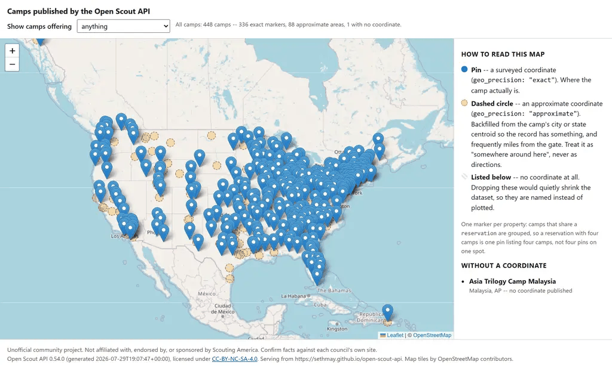

# Open Scout API

[](https://sethmay.github.io/open-scout-api/v1/meta.json)
[](https://github.com/sethmay/open-scout-api/actions/workflows/pages.yml)
[](https://sethmay.github.io/open-scout-api/v1/councils/index.json)
[](https://sethmay.github.io/open-scout-api/v1/camps/index.json)
[](./LICENSE)
[](./NOTICE.md)

**Open, versioned, machine-readable reference data for Scouting America (BSA):** councils, Council
Service Territories, camps, merit badges, ranks, requirements, awards, OA lodges, and more. Published
as static JSON with JSON Schemas, so you can build on it without scraping and without running a
server.

> [!IMPORTANT]
> **Unofficial community project.** Not affiliated with, endorsed by, or sponsored by Scouting
> America / Boy Scouts of America. No trademark claim or endorsement is implied. Facts are
> aggregated from public sources with per-fact provenance. Always confirm against each council's
> own site.

## Why this exists

No official machine-readable BSA structural data exists. Scraping gets you today's snapshot; the
hard part is **history**. Councils merge and rename, regions became territories, badges get retired
and revised. So this dataset models change and uncertainty as first-class data. Every fact carries its
source, method, verification date, and a confidence score, and nothing unverified is presented as
settled.

That means it can answer questions a snapshot cannot:

- *Which council serves this camp, and what was it called in 1998?*
- *How many of Eagle's 14 merit-badge slots has this Scout filled?* (14 slots, 18 flagged badges, and
  21 cumulative are three different numbers.)
- *Which camps offer aquatics?* (Filtering on `aquatics` finds 61 camps. The right answer is 321.)
- *This badge was renamed twice. What's the lineage?* (`clerk → business → american-business`)
- *Is this fact still trustworthy, and who says so?*

## See it working

The [**live camp map**](https://sethmay.github.io/open-scout-api/starters/camp-map/) plots all 448
camps straight from the API, and it distinguishes what it knows from what it guessed. The 336
surveyed coordinates are pins; the 111 city- or state-centroid backfills are dashed areas, because
rendering those as pins would put camps miles from the gate. Camps sharing a reservation collapse
into one marker, so the 447 placeable camps render as 336 pins and 88 areas. The one camp with no
coordinate at all is named rather than silently dropped.

[](https://sethmay.github.io/open-scout-api/starters/camp-map/)

It's a single HTML file with no build step: [`cookbook/ts/starters/camp-map/`](./cookbook/ts/starters/camp-map/).

## Try it in 30 seconds

```bash
# every current council, denormalized and ready to use
curl -s https://sethmay.github.io/open-scout-api/v1/current/councils.json | jq '.count'
# 229

# a council that was renamed and absorbed another, with history included
curl -s https://sethmay.github.io/open-scout-api/v1/councils/mississippi-riverlands.json \
  | jq '{id, versions: (.versions|length), events: [.events[].type]}'
# { "id": "mississippi-riverlands", "versions": 1, "events": ["absorbed", "renamed"] }
```

```js
const { items } = await (await fetch(
  "https://sethmay.github.io/open-scout-api/v1/current/camps.json")).json();
```

Base URL: `https://sethmay.github.io/open-scout-api/`, path-versioned under `/v1/`. Resolve
endpoints from [`v1/meta.json`](https://sethmay.github.io/open-scout-api/v1/meta.json) rather than
hardcoding them. See the caveat in [`docs/endpoints.md`](./docs/endpoints.md).

## What's in it

| Dataset | Total | Current | What it is |
|---|---:|---:|---|
| [Councils](./docs/datasets.md#councils) | 420 | 229 | Councils incl. merged/renamed/defunct, with lineage |
| [Territories](./docs/datasets.md#territories) | 20 | 14 | Council Service Territories + legacy regions |
| [Camps](./docs/datasets.md#camps) | 448 | 448 | Resident, day, high-adventure + the 4 national bases |
| [Merit badges](./docs/datasets.md#merit-badges) | 268 | 140 | Back to the 1910 originals, with rename chains |
| [Requirement sets](./docs/datasets.md#requirement-sets) | 667 | 292 | Full requirement trees, effective-dated |
| [Cub adventures](./docs/datasets.md#cub-adventures) | 177 | 139 | The unit of Cub advancement |
| [Ranks](./docs/datasets.md#ranks) | 21 | 21 | All four programs, Lion through Quartermaster |
| [OA lodges](./docs/datasets.md#oa-lodges) | 238 | 238 | Order of the Arrow, linked to chartering council |
| [Awards](./docs/datasets.md#awards) | 52 | 52 | Knots, honors, and training awards |
| [Positions](./docs/datasets.md#positions-of-responsibility) | 29 | 29 | Youth leadership positions of responsibility |
| [Adult training](./docs/datasets.md#adult-training) | 28 | 28 | Courses by code, plus 67 position-trained rules |
| [Badge popularity](./docs/datasets.md#merit-badge-popularity) | 5 yrs | n/a | 2021-2025 rankings; **ranks, not counts** |

Full detail, sourcing, and caveats per dataset: [**`docs/datasets.md`**](./docs/datasets.md).

## Five ways this data will fool you

Modeling change this way has a cost: the naive query often returns a *plausible wrong answer*
rather than an error. Each of these has a runnable fix in the cookbook.

```js
camps.filter(c => c.features.includes("aquatics"))  // 61 of 321; codes are hierarchical
if (!badge.eagle_required) { /* not required */ }   // historical badges are null = UNKNOWN
average(ranks)                                      // earned_rank is ORDINAL. Meaningless.
map.pin(camp.lat, camp.lon)                         // plots state centroids as real camps
events.filter(e => e.type === "renamed")            // finds 1 council; 57 were renamed
```

Renames live in the version sequence and mergers live in events, which is why the last one finds
only a single council. See [`docs/model.md`](./docs/model.md).

## Cookbook

[**`cookbook/`**](./cookbook) is runnable example code in **Python, TypeScript, C#, SQL, and shell**:
42 recipes plus three starter apps. Every recipe is executed by CI against a freshly built dataset
and asserts its own invariants, so an example that has quietly stopped being true fails the build
instead of teaching you the wrong thing.

```bash
python tools/validate_cookbook.py     # 36 checks over all 42 recipes, against a local build
```

Each recipe kills one specific trap and names it in a `TRAP:` line. Real output:

```
$ python cookbook/python/05-feature-hierarchy.py
vocabulary      camp-features: 128 terms, 8 with children
aquatics        expands to 22 codes (20 direct)
deepest chain   ice_fishing -> fishing -> aquatics
bare code       61 camps carry "aquatics" itself
closure match   321 camps carry something in the closure
top codes       swimming=218, fishing=189, canoeing=183, kayaking=143, sailing=102
missed by trap  260 camps a bare `in features` check drops
```

Consumer types for TypeScript and C# are generated from the published schemas and CI-gated against
drift, via `python tools/gen_types.py --check`.

## Documentation

| Document | Covers |
|---|---|
| [**`docs/endpoints.md`**](./docs/endpoints.md) | Every endpoint, the projection contract, pinning, the SQLite artifact |
| [**`docs/datasets.md`**](./docs/datasets.md) | What is in each dataset, how it was sourced, and its caveats |
| [**`docs/model.md`**](./docs/model.md) | Identity, effective-dated versions, events, provenance, refs |
| [**`cookbook/README.md`**](./cookbook/README.md) | Every recipe mapped to the trap it prevents |
| [`PLAN.md`](./PLAN.md) · [`TODO.md`](./TODO.md) | Design rationale · roadmap and open questions |

## Status

**Pre-1.0.** Field shapes are stable and build-gated: every published file names its contract in
`$schema`, and the build fails on drift. `v1` fields are **additive-only**, so pinning to a
field set is safe. What is *not* yet frozen is the **host**: the base URL is provisional while a
permanent home is settled, which is exactly what cutting `1.0` will freeze. Until then, resolve
endpoints from `v1/meta.json` and pin data files by git tag via jsDelivr, because tags are immutable
wherever the repo ends up.

[camp-finder](https://github.com/sethmay/camp-finder) consumes this API as its core data.

## Repository layout

```
data/       authoritative source: canonical JSON, one file per entity
schema/v1/  JSON Schemas (draft 2020-12), canonical + published contracts
tools/      validate, build, and the cookbook/codegen gates
cookbook/   consumer examples in five languages + starter apps
docs/       endpoint, dataset and data-model reference
dist/       the generated static API (git-ignored; built and deployed by CI)
```

The repo **is** the database: writes happen via pull request, a CI validation gate blocks bad
merges, and GitHub Pages serves the built API. There is no runtime backend.

## Local development

Requires Python 3.11+.

```bash
pip install "jsonschema[format]"
python tools/validate_data.py        # schema + referential + version-window invariants
python tools/build.py                # compile data/ -> dist/  (open dist/index.html)
python tools/build_sqlite.py         # + a queryable SQLite artifact
python tools/validate_cookbook.py    # run every cookbook recipe against it
```

The enrichment and maintenance tools are run manually, never by CI: geocoding, elevation, July
temperature normals, camp link health, base-URL restamping (`restamp_identity.py`) and the
re-verification queue (`maintenance.py`). They carry the only extra dependencies: `july_temp.py`
needs `rasterio` plus the WorldClim rasters (~8 GB, git-ignored). **Their derived caches are
committed, so a normal validate or build needs neither the dependency nor the rasters.**

## Contributing

`data/` is the authoritative source, so edit the canonical JSON directly. There is no upstream to
re-import: `tools/import_camps.py` and `tools/geocode_camps.py` were one-time camp-finder seed
tools, kept for provenance, and `data/` has been hand-corrected since, so don't re-run them. To add
or fix an entity: edit `data/<dataset>/<id>.json`, then run `stamp_schema.py` →
`validate_data.py` → `validate_examples.py` → `build.py`, and open a PR. The same validators gate CI.

A camp rename, or a duplicate/variant folded into another camp, uses **`merged_from`**. The retired
id then resolves via [`v1/camps/aliases.json`](https://sethmay.github.io/open-scout-api/v1/camps/aliases.json),
and `validate_data.py` fails the build if a `merged_from` id is claimed twice or is still a live camp.

Every fact needs a checkable source in its `provenance` block; no bare high confidence without a
citation. New entities follow the id, versioning, and event conventions in
[`docs/model.md`](./docs/model.md) and [`PLAN.md`](./PLAN.md) §3.

## License & attribution

- **Data** (`data/` and the published projections): **[CC BY-NC-SA 4.0](./LICENSE)**: reuse with
  attribution, non-commercial, share-alike.
- **Code** (`tools/` and `cookbook/`): **MIT**, so you can lift a recipe into your own app whatever its
  license.

> [!WARNING]
> **Merit badge, rank, and Cub adventure requirement text is © Scouting America.** It is reproduced
> with attribution for non-commercial use, is marked `includes_official_text` + `text_rights` on the
> documents that carry it, and is **not** covered by this dataset's license, so don't relicense it.
> Only the requirement structure, numbering, and metadata are this project's contribution.

Seed sources and how to attribute: [`NOTICE.md`](./NOTICE.md).
