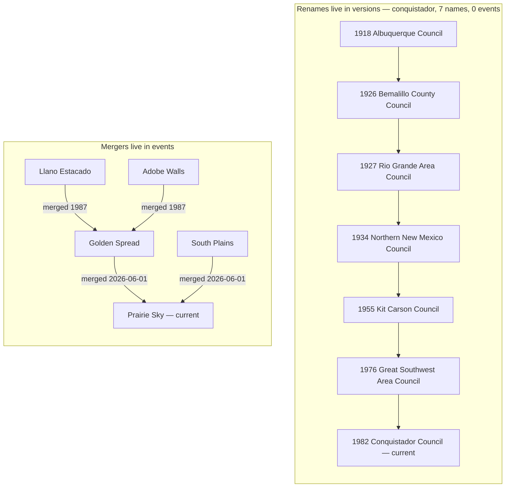

# The data model

How this dataset models change and uncertainty: permanent identity, effective-dated versions,
lifecycle events, per-fact provenance, and entity references.
[← README](../README.md) · siblings: [endpoints](./endpoints.md) · [datasets](./datasets.md)

No official machine-readable Scouting America structural data exists, and collecting the facts is
the easy part. The hard part is that the facts have *dates*. Councils merge and rename, regions
became territories, badges are introduced and discontinued, requirements are revised. A snapshot
dataset rots the day it is published. This one answers both "what is true now" and "what was true
then", which forces five design decisions a consumer has to understand to read the data correctly.

The model is **valid-time only** (when a fact was true in the world). Full bitemporality is
deliberately skipped; `verified_at` covers "when we learned it" informally. Nothing in the id
scheme precludes adding record-time later.

---

## 1. Identity is permanent and separate from state

Every entity is one JSON file whose `id` is a dataset-scoped slug: `^[a-z0-9][a-z0-9-]*$`, unique
within its dataset, **permanent, never reused, never deleted**. Nothing mutable is encoded in it,
notably not a council's BSA number, which is an attribute that can change. Historical collisions
are disambiguated with an era suffix (`-1935`) rather than by recycling a slug.

Everything that can change (name, number, headquarters, website, states served, territory
membership, status) lives in `versions[]`. Each version is a **full snapshot** of the attributes
during its window (record-level SCD-2, not attribute-level). Changes are rare: a council renames a
few times per century. Full snapshots therefore diff cleanly and are trivial to consume.

**Worked example: `territory:cst-1`.** One identity, and even the *kind of thing it is* changed:

| window | `name` | `division_type` |
|---|---|---|
| `2021` → `2024` | National Service Territory 1 | `national_service_territory` |
| `2024` → `null` | Council Service Territory 1 | `council_service_territory` |

The 2021 reorganization replaced 4 regions with 16 National Service Territories; the 2024 pass
renamed them Council Service Territories and folded two into neighbours, leaving 14. The regions
are still in the dataset as their own entities with closed windows: 20 territory entities, 14
current. Consumers who stored `territory:cst-1` in 2022 still resolve it today.

> [!NOTE]
> The published `current/*.json` projections exist so consumers never have to reassemble the
> temporal model just to get "the current council list." See [endpoints](./endpoints.md).

## 2. Validity windows are half-open `[valid_from, valid_to)`

- A successor's `valid_from` **equals** its predecessor's `valid_to`. The boundary instant belongs
  to the *later* window only. Citizenship in Society's `2022-07-01` boundary appears literally in
  both of its version records; under half-open comparison there is no overlap.
- `null` means **open-ended in that direction**: `valid_from: null` is "unknown/always",
  `valid_to: null` is "still in force". A null bound is not a missing value. Never treat it as
  one.
- Dates are `HistoricalDate`: `YYYY`, `YYYY-MM`, or `YYYY-MM-DD`. Real history is often
  year-precision only. Bookkeeping dates (`verified_at`, `imported_at`, `accessed`) are always
  full ISO dates.
- **At most one version per entity may have `valid_to: null`, and that version is what "current"
  means.** `tools/validate_data.py` enforces it directly: only the last version may be open-ended,
  windows must be ordered and abut under half-open comparison, and a window may not run backwards
  (an inverted window is empty, so *no* date is ever in force in it; the check exists because
  `chippewa-valley` once shipped a `1927..1925` window that the pairwise adjacency rule could not
  see).
- A retired entity has **no** open-ended version. Its fate is in the events file, not in a status
  flag. Of 420 council entities, 229 are current and 191 are retired.

**Worked example: a versioned *flag*, not a name.** `merit-badge:citizenship-in-society` never
changed its name; what changed is a boolean:

| window | `name` | `eagle_required` |
|---|---|---|
| `2021` → `2022-07-01` | Citizenship in Society | `false` |
| `2022-07-01` → `2026-02-27` | Citizenship in Society | `true` |

This is why a flag must be read *with its window*, not plucked from the entity. A Scout who
finished the badge in early 2022 did not earn an Eagle-required badge; one who finished in 2023
did. Both versions are closed and the entity has no open-ended version, because the badge was
discontinued 2026-02-27 (an event). So the correct answer to "was it Eagle-required?" is a question
about a date, and any code that answers it without one is guessing.

> [!IMPORTANT]
> **`versions[0]` is NOT the current state. It is the oldest snapshot.** The array is ordered by
> `valid_from`, ascending, which is the opposite of what a "read the first record" habit expects.
> Any council that was ever renamed carries a decades-dead name at `versions[0]`:
> `council:conquistador`'s is *Albuquerque Council*, retired in 1926.
>
> "Current" is a property of the version (`valid_to is None`), never of its position in the array.
> To resolve state on an arbitrary date, select the version whose half-open window contains the
> instant, treating null bounds as open-ended. Recipe:
> [`02-as-of.py`](../cookbook/python/02-as-of.py).

## 3. Change is an explicit event, but renames are not

Mergers, splits, absorptions, reorganizations, introductions, and retirements are first-class
records in the dataset's `_events.json`, linking predecessor and successor entities rather than
silently overwriting fields. Events are stored **once**, normalized, and never duplicated into
entity files (dual-write hazard); the build projects the relevant ones into each entity's published
document.

Participant roles: `subject` (single-entity events), `predecessor`, `successor`, and `continuing`
(an absorption where one side keeps its identity).

Renames are the exception:

> [!WARNING]
> **Renames live in the `versions` sequence. Mergers and absorptions live in `events`.**
> Grepping `_events.json` for `type == "renamed"` finds almost nothing, so the dataset looks like
> it has no rename history. Verified against `data/councils/`: **57 of 420 councils were renamed**
> (more than one distinct `name` across their versions), while **exactly 1 council carries a
> `renamed` event**. A council rename *is* the `name` field changing between consecutive versions.
> Diff `name` across versions ordered by `valid_from`; never rely on an event to tell you.

The split is deliberate. A rename keeps the identity, so it is expressible as a version boundary
and needs no second record. A merger changes *which identity carries on*, which version windows
cannot express, so it must be an event. Where an event does duplicate a rename it is editorial
emphasis, not the source of truth: the 2024 NST→CST pass carries one `renamed` event with 14
subjects *and* the rename sits in all 14 version sequences.

**Worked example A: `council:conquistador` has 7 versions, 7 different names, and 0 events.**

| window | `name` |
|---|---|
| `1918` → `1926` | Albuquerque Council |
| `1926` → `1927` | Bemalillo County Council |
| `1927` → `1934` | Rio Grande Area Council |
| `1934` → `1955` | Northern New Mexico Council |
| `1955` → `1976` | Kit Carson Council |
| `1976` → `1982` | Great Southwest Area Council |
| `1982` → `null` | Conquistador Council *(current)* |

`bsa_number` is 413 throughout. The slug never changed. No event mentions this council at all.

> [!NOTE]
> "Bemalillo" is the source's spelling, preserved verbatim rather than silently corrected. The
> New Mexico county is *Bernalillo*. Correcting it is a data change with its own provenance, not a
> transcription liberty.

**Worked example B, the Golden Spread / Prairie Sky chain: identity changes hands, via events.**

Two `merged` events in `data/councils/_events.json`, each with `predecessor` and `successor`
participants, connect five council identities across 39 years:



`llano-estacado`, `adobe-walls`, `golden-spread`, and `south-plains` all still exist as entities
with closed final windows. A stored id that has vanished from a `current/` projection is **not**
defunct. Walk `predecessor → successor|continuing` forward and point the user's bookmark at the
council that survived. Recipe: [`03-lineage.py`](../cookbook/python/03-lineage.py).

Merit-badge supersession is the contrast: that lineage *is* an event, and its `date` is
usually null, so order such a walk by graph edges, never by date.

## 4. Every fact carries provenance

`provenance` is **required on every version record, every event, and every requirement set**. It
applies per fact, and the schema enforces it.

| field | meaning |
|---|---|
| `sources[]` | at least one `{ url }` or `{ citation }`, optional `accessed` date |
| `method` | `curated`, `official_publication`, `scraped`, `llm_extraction`, `community`, `imported` |
| `verified_at` | full ISO date a human or pipeline last confirmed this record against its sources |
| `imported_at` | full ISO date this record was ingested here; present on imported records only |
| `confidence` | 0–1 extraction confidence, *not* source authority |

Merge precedence when passes overlap: `curated`/`official_publication` > `community` > `scraped` >
`llm_extraction`. An `llm_extraction` record **must** declare `confidence < 1.0`.
`common.schema.json` expresses that as an `if`/`then` on the method, so a schema validator rejects
a machine extraction claiming certainty.

**Unverified inferences are flagged, not fabricated.** The convention is an explicit shape: a
`null` date, confidence in the 0.4–0.6 band, and a note saying exactly what is unknown. Real dates
with citations sit at 0.8+.

The lone `renamed` council event is itself the worked example:

```jsonc
{
  "id": "rename-andrew-jackson-to-mississippi-riverlands",
  "type": "renamed",
  "date": null,                                    // <- the inference, declared
  "participants": [{ "ref": "council:mississippi-riverlands", "role": "subject" }],
  // notes: "Council 303 shown as 'Mississippi Riverlands' on 2026 CST maps; camp-finder lists
  //         former name 'Andrew Jackson Council'. Date unverified."
  "provenance": {
    "sources": [{ "citation": "Scouting America CST map (production 2026-06)" }],
    "method": "curated", "verified_at": "2026-07-21", "confidence": 0.6
  }
}
```

We know the rename happened; we do not know when. `date: null` + `0.6` + a note that says so is
the correct encoding. Contrast `absorb-beaufort-into-coastal-carolina`: `date: "1940"`, a source
URL, `confidence: 0.8`. And `discontinued-rip-van-winkle` sits at the bottom of the band:
`date: null`, `confidence: 0.4`, note "Absent from 2026 official CST maps; presumed
merged/discontinued. Successor and date unverified." Nothing was invented to fill the gap.

### `verified_at` vs `imported_at`

These are different facts about different things, and a staleness check that uses the wrong one
silently reports that nothing is ever stale.

- **`verified_at`: when the fact was last confirmed against its sources.** For a record imported
  from a sibling project it is *that project's* confirmation date, not ours. This is the only date
  a staleness rule may use.
- **`imported_at`: when our pipeline ingested the record.** It measures *us*. Ingest dates
  cluster at the most recent import, so a "stale after 12 months" rule keyed on `imported_at`
  under-reports, often to zero. The gap only widens over time, because `verified_at` ages while
  `imported_at` is refreshed by any re-import.

`camps/al-camp-tukabatchee` shows the divergence directly: `verified_at: 2026-07-17`,
`imported_at: 2026-07-21`, `method: imported`, `confidence: 0.6`. Recipe:
[`15-staleness.py`](../cookbook/python/15-staleness.py), which asserts strictly that
`imported_at` under-reports, so the recipe fails if anyone "simplifies" it.

## 5. Entity references

A cross-entity reference is the string **`{kind}:{slug}`**, as in `council:tukabatchee-area`,
`merit-badge:first-aid`, `position:patrol-leader`, and `territory:cst-1`. `validate_data.py` checks
that every ref (a council's `territory`, a camp's `council`, every event `participants[].ref`, and
every requirement node's `ref`) resolves to an entity file whose own `kind:id` agrees.

### The deliberate exception: `reservation.id`

A camp's `reservation` is `{ "id": <bare slug>, "name": <string|null> }`, **not** an EntityRef,
because no reservation entity exists. `al-camp-tukabatchee` carries
`{ "id": "al-warner-scout-reservation", "name": "Warner Scout Reservation" }` alongside a real ref,
`"council": "council:tukabatchee-area"`. The two shapes differ on purpose: one resolves, the other
does not.

> [!WARNING]
> `reservation.id` is a **stable opaque grouping key**. Group by it (18 groups covering 41 camps)
> so a map renders one pin per physical property instead of five stacked markers. **Never parse
> it.** The state prefix and the words inside it are not a contract. If a reservation dataset is
> ever added it will reuse these exact slugs as entity ids and any reference will arrive as a
> **new additive field**; this `id` will not change format or meaning.
> Recipe: [`09-reservation-grouping.py`](../cookbook/python/09-reservation-grouping.py).

### Refs resolve against `index.json`, never `current/`

An in-force document may legitimately reference a **discontinued** entity. That is what the
sources say, not a data error.

`requirement-sets/eagle-2024` has `effective_to: null`: it is the requirement set in force.
Requirement `3d` reads `{ "number": "3d", "text": "Citizenship in Society",
"ref": "merit-badge:citizenship-in-society" }`. That badge's last version closed 2026-02-27
and it carries a `discontinued` event, so it has no open-ended version. Correspondingly it is
**absent from `v1/current/merit-badges.json`** but **present in `v1/merit-badges/index.json`**
(verified against the built `dist/`).

A consumer resolving requirement refs against `current/` therefore drops requirement 3d and
renders a broken Eagle tree. **Resolve refs against `{dataset}/index.json`** (the full corpus,
current and historical) and use `current/` only when you specifically want "what exists today."
Recipe: [`12-requirement-tree.py`](../cookbook/python/12-requirement-tree.py).

> [!IMPORTANT]
> Requirement **text** is © Scouting America, reproduced with attribution for non-commercial use
> and **not** covered by this dataset's CC BY-NC-SA license. Structure, numbering, `ref`s, and
> effective dates are the dataset's own; verbatim text is not. Every requirement set carries
> `includes_official_text` and `text_rights` so a consumer can strip or withhold it. See
> [`NOTICE.md`](../NOTICE.md).

---

## Consequences for consumers

1. **Never read `versions[0]` as the current record.** Select by window, or by
   `valid_to is None`. → [`02-as-of.py`](../cookbook/python/02-as-of.py)
2. **Never look for renames in `events`.** 57 councils renamed; 1 `renamed` event. Diff `name`
   across consecutive versions. → [`03-lineage.py`](../cookbook/python/03-lineage.py)
3. **A missing id is not a dead id.** An id absent from `current/` may have merged. Walk
   `predecessor → successor|continuing` and forward the reference instead of dropping it. →
   [`03-lineage.py`](../cookbook/python/03-lineage.py)
4. **Key staleness on `verified_at`, never `imported_at`.** And read `confidence` alongside it: a
   0.4 fact and a 0.9 fact are not interchangeable. →
   [`15-staleness.py`](../cookbook/python/15-staleness.py)
5. **Resolve `{kind}:{slug}` refs against `{dataset}/index.json`.** In-force documents reference
   discontinued entities. Group by `reservation.id`; never parse it. →
   [`12-requirement-tree.py`](../cookbook/python/12-requirement-tree.py)
